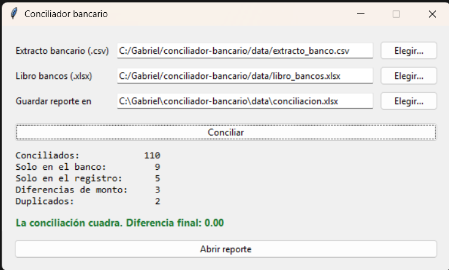
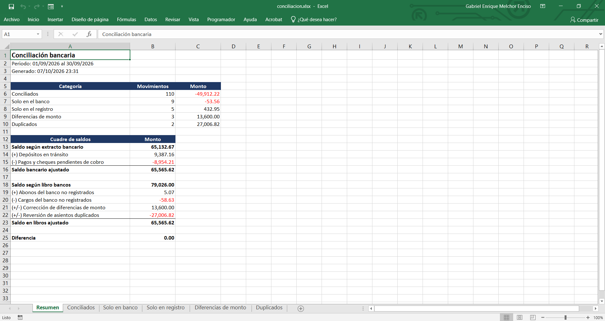

# Conciliador bancario

Herramienta de escritorio en Python que concilia el extracto bancario de una cuenta corriente con el libro bancos de la empresa, clasifica cada diferencia y entrega un reporte en Excel con el cuadre de saldos.



**[Descargar para Windows](https://github.com/Gabriel250604/conciliador-bancario/releases/latest)** (no requiere instalar Python)

## El problema

Al cierre de cada mes, el saldo que informa el banco y el que registra contabilidad casi nunca coinciden. La diferencia se explica por movimientos que uno de los dos lados todavía no registra, como comisiones, ITF, cheques girados que aún no se cobran o depósitos en tránsito, y por errores de registro, como montos mal digitados o asientos duplicados.

Encontrarlos a mano implica cruzar cientos de filas entre un CSV del banco y un Excel contable que tienen formatos distintos, números de operación que Excel recorta y fechas que no siempre coinciden.

## Qué hace

1. Lee el extracto (CSV) y el libro bancos (Excel) y los lleva a una misma estructura: fecha, número de operación y un solo monto con signo.
2. Valida la integridad del extracto recalculando el saldo fila por fila. Si un monto fue alterado o falta un movimiento, se detiene e indica en qué fila.
3. Cruza ambos lados en cascada y clasifica cada movimiento.
4. Calcula el cuadre de saldos y genera un Excel con una hoja de resumen y una hoja por categoría.

### Cruce en cascada

Cada paso trabaja solo con lo que el anterior no resolvió.

| Paso | Regla | Resultado |
|---|---|---|
| 1 | Asientos del libro con el mismo número de operación y el mismo monto | Duplicados |
| 2 | Mismo número de operación | Conciliado si el monto coincide, diferencia de monto si no |
| 3 | Mismo monto con hasta 3 días de diferencia, empezando por la fecha más cercana | Conciliado |
| | Lo que queda sin pareja | Solo en el banco o solo en el registro |

Un movimiento nunca se usa dos veces: si el banco tiene un cargo de 100 y el libro tiene dos asientos de 100, solo uno concilia.

### Reporte



El cuadre de la hoja Resumen está construido con fórmulas que apuntan a las hojas de detalle. Cada cifra se puede rastrear hasta las filas que la componen, y si se corrige una partida en el detalle, el cuadre se recalcula.

## Cómo comprobé que funciona

No usé extractos reales porque son información confidencial. En su lugar, `src/generar_datos.py` crea un extracto y un libro bancos de septiembre de 2026 con diferencias sembradas a propósito, y guarda la lista exacta en `data/diferencias_esperadas.csv`. La semilla es fija, así que cualquiera obtiene los mismos archivos.

Los datos imitan los problemas de un archivo real: el extracto trae líneas de encabezado antes de la tabla, viene en codificación de Windows con montos como texto (`7,969.60`), 15 números de operación del extracto empiezan con cero y en el libro Excel elimina ese cero, 15 asientos que sí están en el banco no tienen número de operación y 30 se registraron uno o dos días después que en el banco.

| Categoría | Sembradas | Encontradas |
|---|---:|---:|
| Conciliados | 110 | 110 |
| Solo en el banco (comisiones, ITF, intereses) | 9 | 9 |
| Solo en el registro (cheques y depósitos en tránsito) | 5 | 5 |
| Diferencias de monto (dígitos invertidos) | 3 | 3 |
| Duplicados | 2 | 2 |

De los 110 conciliados, 95 cruzan por número de operación y 15 por monto y fecha.

| Cuadre | Monto |
|---|---:|
| Saldo según extracto bancario | 65,132.67 |
| Saldo bancario ajustado | 65,565.62 |
| Saldo según libro bancos | 79,026.00 |
| Saldo en libros ajustado | 65,565.62 |
| **Diferencia** | **0.00** |

Las 26 pruebas de `tests/` comparan el resultado contra la lista de diferencias sembradas, verifican que ningún movimiento quede en dos categorías, que el cuadre dé cero, que un saldo alterado se detecte y que el reporte guarde montos como números y números de operación como texto.

## Uso

### Ejecutable

1. Descarga `ConciliadorBancario.exe` desde [Releases](https://github.com/Gabriel250604/conciliador-bancario/releases/latest). Ahí también está `datos_de_ejemplo.zip` para probarlo.
2. Ábrelo con doble clic. La primera vez Windows puede mostrar "Windows protegió su PC" porque el ejecutable no tiene firma digital: **Más información** y luego **Ejecutar de todas formas**.
3. Elige el extracto, el libro bancos y dónde guardar el reporte, y haz clic en **Conciliar**.

### Desde el código

```powershell
git clone https://github.com/Gabriel250604/conciliador-bancario.git
cd conciliador-bancario
python -m venv .venv
.venv\Scripts\Activate.ps1
pip install -r requirements-dev.txt

python src\generar_datos.py      # vuelve a crear los datos de prueba
python src\conciliacion.py       # muestra el resultado en la terminal
python src\reporte.py            # genera salida\conciliacion.xlsx
python src\app.py                # abre la ventana
pytest                           # ejecuta las 26 pruebas
```

Para generar el ejecutable:

```powershell
pyinstaller --onefile --windowed --name ConciliadorBancario --paths src src\app.py
```

## Estructura

```
conciliador-bancario/
├── data/
│   ├── extracto_banco.csv          extracto de prueba
│   ├── libro_bancos.xlsx           libro bancos de prueba
│   └── diferencias_esperadas.csv   diferencias sembradas
├── docs/                           capturas
├── src/
│   ├── generar_datos.py            generador de datos de prueba
│   ├── lectura.py                  lectura, limpieza y validación
│   ├── conciliacion.py             cruce en cascada y cuadre
│   ├── reporte.py                  reporte en Excel
│   └── app.py                      ventana
└── tests/                          pruebas con pytest
```

## Decisiones

- **Datos sintéticos con diferencias conocidas.** Con un archivo real no hay forma de saber si el conciliador encontró todas las diferencias. Con diferencias sembradas, cada una es verificable.
- **Montos comparados en céntimos enteros.** En coma flotante `0.1 + 0.2` no es exactamente `0.3`, y dos montos iguales pueden parecer distintos.
- **Validar el saldo antes de conciliar.** Si el extracto está incompleto o alterado, cualquier conciliación sobre él es inválida, así que el programa se detiene en lugar de producir un resultado que parece correcto.
- **Prioridad a la fecha más cercana en el paso 3.** Cuando hay varios candidatos del mismo monto, el emparejamiento más probable es el de menor desfase.
- **El cuadre con fórmulas y no con valores fijos.** Quien revisa el reporte puede verificar cada cifra sin confiar en el programa.

## Limitaciones

- Lee un solo formato de extracto: CSV separado por punto y coma con las columnas Fecha, Descripción, N° Operación, Cargo, Abono y Saldo. Para otro banco habría que adaptar `lectura.py`.
- Trabaja con una sola moneda por conciliación.
- Solo detecta duplicados que tienen número de operación. Un asiento sin número registrado dos veces aparece como "solo en el registro".
- Si hay dos movimientos del mismo monto dentro de los 3 días de tolerancia, el emparejamiento por cercanía de fecha puede no ser el correcto. La hoja Conciliados indica la regla usada en cada par para que esos casos se revisen.
- Asume que el saldo inicial del libro es igual al del banco, es decir, que la conciliación del mes anterior quedó cerrada.
- La tolerancia de 3 días se cambia en el código, no desde la ventana.

## Herramientas

Python 3.13, pandas, openpyxl, tkinter, pytest y PyInstaller.
